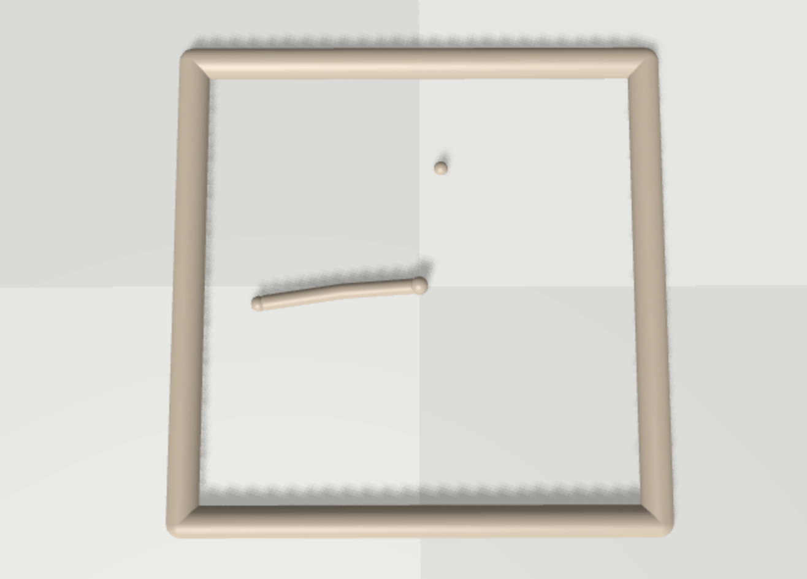
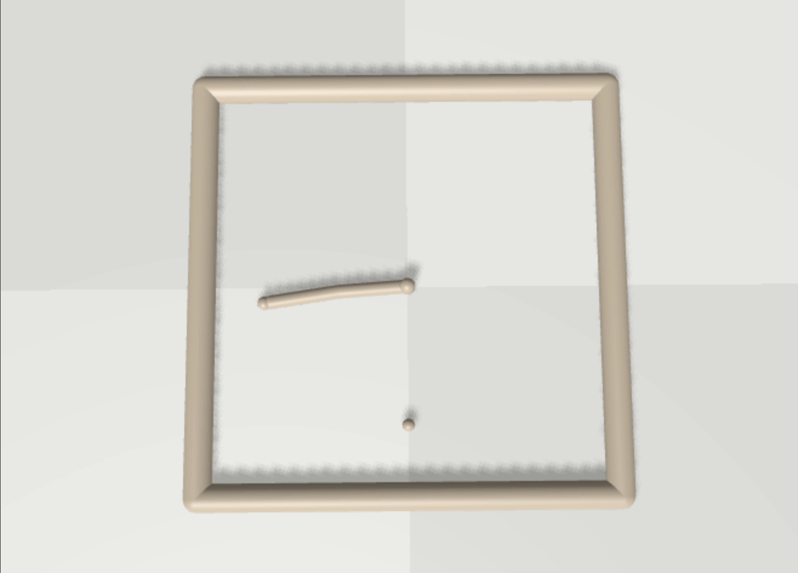

# ANYmal BRAX
This repository contains code and files to train ANYmal robot in simulation using RL. 
Besides the raw training code, convenience functions are provided for logging training progress in BRAX. 
To benefit from the gradients provided by the fully differentiable simulation, applications of APG are explored.

**DISCLAIMER: This code is not official research code, but was instead developed as part of a course project at ETH (course: Digital Humans). No guarantees for its completeness or correctness can be provided.**

The given code is made publicly available for the benefit of the robotics/simulation communities, to have a trainable model of a real legged robot.

**Authors:** [Turcan Tuna](https://www.turcantuna.com/), [Julian Nubert](https://www.juliannubert.com), Jonas Frey, Sahana Betschen

**Supervisor:** Miguel Zamora


## Getting Started
In order to get started, clone this repository together with its submodule(s).

```bash
git clone --recurse-submodules https://github.com/leggedrobotics/anymal_brax.git
```

### Dependencies
In order to run our code, the following dependencies need to be installed. These mainly contain:
* Torch
* JAX
* BRAX

We provide a conda environment file to simplify this installation. Execute:
```bash
conda env create -f conda/anymal-brax-3.11.yml
```
Next activate the given environment.
```bash
conda activate anymal-brax-3.11.yml
```

### Test the Environment
The most brittle part about the setup usually includes the successful JAX installation, suitable for GPU. In order to verify the correctness of the installation, run the following script that we provide:
```bash
python3 bin/test_jax_gpu.py
```
If this is outputting something like
```
Fast took  0.03966069221496582
Slow took 0.11339068412780762
1.0
-1.0
-1.0
```
you are good to go.

### Environment Setup
In a next setup, you can install our environment. This will also install the [BRAX library](https://github.com/google/brax/tree/v0.9.1) at release `v0.9.1` for you.
```bash
pip install -e submodules/brax
pip install -e .
```

## Training Monitoring
For the monitoring of the training runs we provide an MLFlow interface, which lets you navigate through the training run such as shown in this example:

In order to do so, you have to start an MLFlow-server in the root directoy of this repository. This will then visualize the runs in the `mlruns` folder, which is used for logging during training.
To start the server, run:
```bash
mlflow server
```
This should output something like:
```
[2023-06-15 18:35:07 +0200] [576067] [INFO] Starting gunicorn 20.1.0
[2023-06-15 18:35:07 +0200] [576067] [INFO] Listening at: http://127.0.0.1:5000 (576067)
[2023-06-15 18:35:07 +0200] [576067] [INFO] Using worker: sync
[2023-06-15 18:35:07 +0200] [576068] [INFO] Booting worker with pid: 576068
[2023-06-15 18:35:07 +0200] [576069] [INFO] Booting worker with pid: 576069
[2023-06-15 18:35:07 +0200] [576070] [INFO] Booting worker with pid: 576070
[2023-06-15 18:35:07 +0200] [576071] [INFO] Booting worker with pid: 576071
```
Hold ctr and click on the link (`http://127.0.0.1:5000`) to open the browser interface of the training run.
On the left you will be able to see all the experiments (such as `apg_reacher`, `ppo_anymal`, etc.).

Models and videos of the training run can be seen for each experiment run at the bottom in the section "Artifacts".

## ANYmal PPO Training
In order to train walking motions for the quadrupedal robot ANYmal, first a new environment had to be created. It can be found in [this folder](./src/anymal_brax/envs/).

## Reacher PPO Training
The reacher can be trained using PPO RL:
```bash
train_reacher_ppo.py
```
The result can be found in MLFlow under the Experiments section as `ppo_reacher`. The result should look something like:


## Reacher APG Training
As one of our main motivations for using BRAX was the availability of gradients, thanks to the differential nature of BRAX and JAX, we played around with the simplest method of its kind:
the Analytical Policy Gradient (APG). As it is not clear how direct gradient learning will scale, due to issues such as
* local optima and
* vanishing/exploding gradients in longer trajectories,

we first started by applying APG to the simpler 2-dimensional reacher example.
To run the training, simply run:
```
train_reacher.py
```
With this we are able to achieve the following results:


## ANYmal APG Training
So far we were not able to achieve walking behavior of ANYmal solely by using APG. However, we successfully used APG in order to acheive standup motions:

The training code for this will follow shortly.